# Roles and Personal Mode Implementation Plan

## Current State Summary


| Aspect           | Current                           | Target                                        |
| ---------------- | --------------------------------- | --------------------------------------------- |
| Roles            | owner, guest, admin               | owner, property_manager, tenant, guest, admin |
| Property Manager | owner sub-type (authorized_agent) | Distinct role with limited permissions        |
| Tenant           | Not modeled                       | New role + model                              |
| Units            | 1 Property = 1 unit               | Property → Unit(s) for multi-unit             |
| Invitation       | Owner → Guest                     | Owner OR Tenant (or resident) → Guest         |
| Personal Mode    | N/A                               | Owner/Manager: Business vs Personal context   |


---

## 0. Sign-Up and Onboarding (New)

### 0.1 Sign-Up Flow: Account Type Selection

**Initial screen** (before any form fields):

```
Are you signing up as:
[ ] Individual Owner
[ ] Property Management Company
[ ] Leasing Company
```

**If Individual Owner:**

- First Name, Last Name, Email, Phone
- Then straight to KYC (identity verification)

**If Company (Property Management Company or Leasing Company):**

- Company Name
- Your Name (Contact Person)
- Email, Phone
- Website (optional)
- Company Type dropdown (e.g. "Property Management Company", "Leasing Company", "Real Estate Agency", etc.)
- Then KYC for the Contact Person (the signer)

**Database / Schema:**

- Add `account_type` to `PendingRegistration` and `User`: `individual` | `property_management_company` | `leasing_company`
- Add `company_name`, `company_website`, `company_type` (nullable) to support company signups
- Split `full_name` into `first_name`, `last_name` for individuals; keep `full_name` for display/legacy
- `OwnerProfile` or new `CompanyProfile`: `company_name`, `company_website`, `company_type`, `contact_user_id`

**Files to modify:**

- [frontend/pages/Auth/RegisterOwner.tsx](frontend/pages/Auth/RegisterOwner.tsx) — add account-type step, conditional fields
- [app/schemas/auth.py](app/schemas/auth.py) — `UserCreate` / registration schemas
- [app/models/pending_registration.py](app/models/pending_registration.py) — new columns
- [app/models/user.py](app/models/user.py) — `account_type`, `first_name`, `last_name`, `company_name`, etc.
- [app/routers/auth.py](app/routers/auth.py) — accept new fields in register

### 0.2 Identity Verification (KYC)

**Current:** Stripe Identity is used ([app/routers/auth.py](app/routers/auth.py), [OnboardingIdentity.tsx](frontend/pages/Onboarding/OnboardingIdentity.tsx)). Flow: create VerificationSession → redirect to Stripe → confirm on return.

**Requirements (ensure Stripe Identity flow includes):**

- Government ID upload
- OCR data extraction (Stripe handles this)
- Selfie + liveness check
- Identity match validation
- Manual review only as fallback (Stripe Identity is automated; manual review is Stripe-side fallback)
- Verified identity record tied directly to the Master POA signer

**Implementation:**

- Stripe Identity Verification Flows support document + selfie/liveness. Ensure `STRIPE_IDENTITY_FLOW_ID` in [app/config.py](app/config.py) uses a flow with:
  - Document verification (government ID)
  - Selfie + liveness
  - Identity match (document vs selfie)
- Store `stripe_verification_session_id` on User (already done) — links verified identity to Master POA signer
- No code changes required if Stripe flow is already configured; otherwise update Stripe Dashboard flow or `flow_id` to include selfie/liveness steps

**Verification flow order:**

1. Sign-up (account type + fields) → email verification
2. KYC (Stripe Identity) — required before POA
3. Master POA — signer must be identity-verified
4. Dashboard access

---

## Architecture Overview

```mermaid
flowchart TB
    subgraph roles [Role Hierarchy]
        Owner[Owner]
        PM[Property Manager]
        Tenant[Tenant]
        Guest[Guest]
    end

    subgraph owner [Owner Context]
        Owner --> BusinessMode[Business Mode]
        Owner --> PersonalMode[Personal Mode]
        BusinessMode --> ManageProps[Manage Properties]
        BusinessMode --> AssignPM[Assign Managers]
        BusinessMode --> Billing[Modify Billing]
        PersonalMode --> InviteGuests[Invite Guests]
        PersonalMode --> Presence[Set Presence]
        PersonalMode --> ViewGuestActivity[View Guest Activity]
    end

    subgraph pm [Property Manager Context]
        PM --> PMBusiness[Business Mode]
        PM --> PMPersonal[Personal Mode]
        PMBusiness --> ViewProps[View Assigned Properties]
        PMBusiness --> InviteTenants[Invite Tenants]
        PMBusiness --> ViewBilling[View Billing Only]
        PMPersonal --> PMResident[Resident Actions for Unit]
    end

    subgraph tenant [Tenant Context]
        Tenant --> InviteGuests2[Invite Guests]
        Tenant --> ManageAuth[Manage Guest Auth]
        Tenant --> Presence2[Set Presence]
    end

    subgraph guest [Guest Context]
        Guest --> ViewStay[View Stay]
        Guest --> QR[QR Verification]
        Guest --> AuditTrail[Audit Trail]
    end
```




---

## 1. Database Layer

### 1.1 Migration: New User Role and Models

**File:** New migration script (e.g. `scripts/migrate_roles_and_units.py`)

- Add `property_manager` and `tenant` to `UserRole` enum in [app/models/user.py](app/models/user.py)
- Keep `owner_type` (owner_of_record vs authorized_agent) for backward compatibility; deprecate `authorized_agent` path for new Property Managers

**New Models:**


| Model                       | Purpose                                                                                                                                                                                       |
| --------------------------- | --------------------------------------------------------------------------------------------------------------------------------------------------------------------------------------------- |
| `Unit`                      | `id`, `property_id`, `unit_label` (e.g. "101"), `occupancy_status`, `owner_profile_id` (for single-unit backward compat). Property can have 0 or many units; 0 = legacy single-unit property. |
| `PropertyManagerAssignment` | `id`, `property_id`, `user_id` (property_manager), `assigned_at`, `assigned_by_user_id`                                                                                                       |
| `TenantAssignment`          | `id`, `unit_id`, `user_id` (tenant), `start_date`, `end_date`, `invited_by_user_id`                                                                                                           |
| `ResidentMode`              | `id`, `user_id`, `unit_id`, `mode` (owner_personal                                                                                                                                            |


**Invitation / Stay Changes:**

- `Invitation`: Add `invited_by_user_id` (nullable; owner_id or tenant_id; owner_id for backward compat)
- `Invitation`: Add `unit_id` (nullable; for multi-unit; property_id remains for single-unit)
- `Stay`: Add `unit_id` (nullable)
- `Stay`: Add `invited_by_user_id` (nullable)

**Presence/Away:**

- Add `presence_status` (enum: `present`, `away`) and `presence_updated_at` to `User` or to a new `ResidentPresence` table keyed by (user_id, unit_id)

**Property Model:**

- `Property`: Add `is_multi_unit` (boolean); when true, units are created from `Unit` table. For single-unit, `Property` continues to behave as today (no Unit rows, or one implicit Unit).

### 1.2 Backward Compatibility

- Existing properties: 1 Property = 1 implicit unit; no `Unit` rows initially. Migration can create one `Unit` per existing `Property` with `unit_label` = "1" or address.
- Existing `owner` users: unchanged; `owner_type` = `owner_of_record` by default.
- Existing `authorized_agent` owners: migrate to `property_manager` role if desired, or keep as owner with restricted UI based on `owner_type`.

---

## 2. Backend / API Layer

### 2.1 Dependencies

**File:** [app/dependencies.py](app/dependencies.py)

- `require_property_manager` — role == property_manager
- `require_tenant` — role == tenant
- `require_owner_or_manager` — owner (with property access) OR property_manager (with assignment)
- `require_resident_for_unit(unit_id)` — user is Owner (Personal Mode for that unit) OR Property Manager (Personal Mode for that unit) OR Tenant (assigned to that unit)
- `get_context_mode()` — returns `business` or `personal` from header/query param `X-Context-Mode: business|personal`

### 2.2 Permission Helpers

**New file:** `app/services/permissions.py`

```python
def can_access_property(user, property_id, mode: str) -> bool
def can_access_unit(user, unit_id, mode: str) -> bool
def can_invite_guest(user, unit_id, mode: str) -> bool
def can_modify_billing(user, owner_profile_id) -> bool  # Owner only
def can_assign_property_manager(user, property_id) -> bool  # Owner only
def can_view_audit_logs(user, property_id) -> bool  # Owner, PM (assigned)
def get_owner_personal_mode_units(user_id) -> list[UnitId]
def get_manager_personal_mode_units(user_id) -> list[UnitId]
```

### 2.3 Router Changes


| Router            | Changes                                                                                                                                                  |
| ----------------- | -------------------------------------------------------------------------------------------------------------------------------------------------------- |
| **owners**        | Filter by `require_owner` + `owner_type != authorized_agent` for billing/payment; add `assign-manager` endpoint; gate billing modification to owner only |
| **New: managers** | `/managers` — list assigned properties, units, occupancy; invite tenants; view logs; view billing (read-only). No billing portal session.                |
| **dashboard**     | Split owner/manager/tenant/guest endpoints; add `X-Context-Mode` support for owner/manager Personal Mode                                                 |
| **invitations**   | Accept `invited_by_user_id` from owner or tenant; validate `can_invite_guest`                                                                            |
| **New: presence** | `POST /presence` — set unit presence/away; `require_resident_for_unit`                                                                                   |


### 2.4 Auth & Registration

**File:** [app/routers/auth.py](app/routers/auth.py)

- Add `property_manager` and `tenant` registration flows
- Tenant: typically invited by Owner/Manager; registration links to `TenantAssignment`
- Property Manager: invited by Owner; registration links to `PropertyManagerAssignment`

### 2.5 Billing

**File:** [app/services/billing.py](app/services/billing.py)

- Billing remains tied to `OwnerProfile`; only owners can modify payment methods or billing
- Property Manager: `GET /dashboard/manager/billing` returns read-only view (invoices, payments) for properties they manage
- Block `portal-session` for non-owners

---

## 3. Frontend Layer

### 3.1 Types

**File:** [frontend/types.ts](frontend/types.ts)

```typescript
enum UserType {
  PROPERTY_OWNER = 'PROPERTY_OWNER',
  PROPERTY_MANAGER = 'PROPERTY_MANAGER',
  TENANT = 'TENANT',
  GUEST = 'GUEST',
  ADMIN = 'ADMIN'
}

type ContextMode = 'business' | 'personal';
```

### 3.2 API Client

**File:** [frontend/services/api.ts](frontend/services/api.ts)

- Map backend `role` to `UserType`: `property_manager` → `PROPERTY_MANAGER`, `tenant` → `TENANT`
- Add `X-Context-Mode` header when user is Owner or Property Manager and has Personal Mode units
- Add `managerApi`, `tenantApi` for manager/tenant endpoints

### 3.3 Routing

**File:** [frontend/App.tsx](frontend/App.tsx)


| Route                         | Role             | Notes                                 |
| ----------------------------- | ---------------- | ------------------------------------- |
| `#dashboard`                  | Owner            | Business Mode                         |
| `#dashboard/personal`         | Owner            | Personal Mode (if has resident units) |
| `#manager-dashboard`          | Property Manager | Business Mode                         |
| `#manager-dashboard/personal` | Property Manager | Personal Mode (if lives on-site)      |
| `#tenant-dashboard`           | Tenant           | Single view                           |
| `#guest-dashboard`            | Guest            | Unchanged                             |


### 3.4 Mode Switcher

**Component:** `ModeSwitcher` (Business / Personal)

- Shown in nav when user is Owner or Property Manager and has at least one Personal Mode unit
- Persists selection in `localStorage` or context; sends `X-Context-Mode` with API requests
- Personal Mode: show resident-like UI (invite guests, presence, guest activity) for selected unit(s)

### 3.5 Dashboards


| Dashboard            | Components                                                                                                                                |
| -------------------- | ----------------------------------------------------------------------------------------------------------------------------------------- |
| **OwnerDashboard**   | Tabs: Properties, Billing, Guests, Invitations, Logs. Mode switcher. Personal Mode: hide billing management; show resident unit selector. |
| **ManagerDashboard** | Properties, Units, Occupancy, Invite Tenant, Logs, Billing (read-only). Mode switcher if lives on-site.                                   |
| **TenantDashboard**  | Assigned unit, Invite Guest, Guest History, Presence toggle                                                                               |
| **GuestDashboard**   | Unchanged (stays, QR, audit trail)                                                                                                        |


### 3.6 Presence / Away

- Add to TenantDashboard and Owner/Manager Personal Mode view
- `POST /presence` with `unit_id`, `status: present|away`
- Display in UI: "You are here" / "Away"

---

## 4. Implementation Order

### Phase 0: Sign-Up and Onboarding (Account Type + KYC)

1. Add account-type selection screen to RegisterOwner (Individual / Property Management Company / Leasing Company)
2. Add conditional form fields: Individual (First/Last name) vs Company (Company name, Contact name, Website, Company Type)
3. DB migration: `account_type`, `first_name`, `last_name`, `company_name`, `company_website`, `company_type` on PendingRegistration and User
4. Update auth schemas and register endpoint to accept new fields
5. Verify Stripe Identity flow includes: government ID, OCR, selfie + liveness, identity match (Stripe Dashboard or flow config)
6. Ensure KYC remains required before Master POA and dashboard access

### Phase 1: Foundation (DB + Permissions)

1. Create migration: add `property_manager`, `tenant` to `UserRole`
2. Add `Unit` model and migration (optional per-property; start with single-unit = 1 Unit per Property)
3. Add `PropertyManagerAssignment`, `TenantAssignment`, `ResidentMode`
4. Add `invited_by_user_id`, `unit_id` to Invitation and Stay
5. Implement `app/services/permissions.py`

### Phase 2: Property Manager Role

1. Add `require_property_manager`, manager registration/invite flow
2. Create `/managers` router: list properties, units, invite tenants, view logs
3. Billing: read-only endpoint for managers
4. Manager dashboard frontend

### Phase 3: Tenant Role

1. Tenant invite flow (Owner/Manager invites tenant to unit)
2. Tenant registration and `TenantAssignment`
3. Tenant dashboard: invite guests, guest history
4. Update Invitation: tenant can create invites for their unit

### Phase 4: Personal Mode

1. `ResidentMode` model and API: link Owner/Manager to unit(s) for Personal Mode
2. `X-Context-Mode` header and `get_context_mode()` dependency
3. Mode switcher UI
4. Personal Mode views: guest invite, presence, guest activity (filtered by unit)

### Phase 5: Presence / Away

1. `presence_status` or `ResidentPresence` table
2. `POST /presence` endpoint
3. Presence toggle in Tenant and Personal Mode views

### Phase 6: Audit & Hardening

1. Audit log filtering by role (owner sees only their properties; manager sees assigned; tenant sees their unit)
2. Ensure no cross-role data leakage
3. Billing: block payment method changes for non-owners

---

## 5. Risk Mitigation


| Risk                        | Mitigation                                                                      |
| --------------------------- | ------------------------------------------------------------------------------- |
| Breaking existing owners    | Keep `owner` role; backward compat for single-unit; no Unit required initially  |
| Billing access for managers | Explicit permission check; `portal-session` only for owner                      |
| Invitation ownership        | `invited_by_user_id` nullable; owner_id for legacy; validate `can_invite_guest` |
| Personal Mode confusion     | Clear UI labels; persistent mode in session                                     |
| Multi-unit migration        | Optional; single-unit properties can remain 1 Property = 1 Unit                 |


---

## 6. Key Files to Modify


| Layer        | Files                                                                                                                                                                                                                                                                                                           |
| ------------ | --------------------------------------------------------------------------------------------------------------------------------------------------------------------------------------------------------------------------------------------------------------------------------------------------------------- |
| Models       | `app/models/user.py`, `app/models/pending_registration.py`, `app/models/owner.py`, new `app/models/unit.py`, `app/models/property_manager_assignment.py`, `app/models/tenant_assignment.py`, `app/models/tenant.py`, `app/models/invitation.py`, `app/models/stay.py`                                           |
| Schemas      | `app/schemas/auth.py`                                                                                                                                                                                                                                                                                           |
| Dependencies | `app/dependencies.py`                                                                                                                                                                                                                                                                                           |
| Services     | `app/services/permissions.py`, `app/services/billing.py`                                                                                                                                                                                                                                                        |
| Routers      | `app/routers/auth.py`, `app/routers/owners.py`, `app/routers/dashboard.py`, new `app/routers/managers.py`, new `app/routers/presence.py`                                                                                                                                                                        |
| Frontend     | `frontend/types.ts`, `frontend/services/api.ts`, `frontend/App.tsx`, `frontend/pages/Auth/RegisterOwner.tsx`, `frontend/pages/Onboarding/OnboardingIdentity.tsx`, `frontend/pages/Owner/OwnerDashboard.tsx`, new `frontend/pages/Manager/ManagerDashboard.tsx`, new `frontend/pages/Tenant/TenantDashboard.tsx` |


