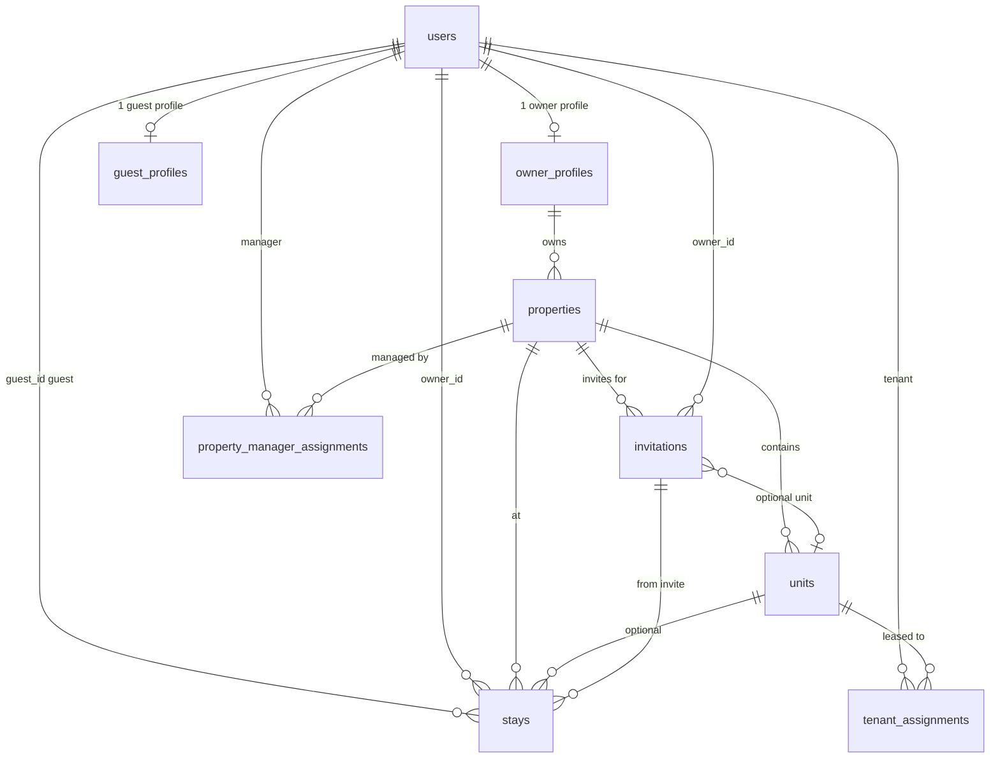

# DocuStay database overview

This document is a **plain-language map** of the main tables and how they connect. The **source of truth** for column details is the SQLAlchemy models under `app/models/` (see `app/models/__init__.py` for the full list).

---

## Big picture

- **`users`** — Every login account (owner, property manager, tenant, guest, admin). Role is stored on the user row.
- **`properties` & `units`** — Physical portfolio: a property has an address and rules; **units** are optional (multi-unit buildings).
- **`invitations`** — An invite to a guest or tenant flow: dates, codes, token state, links to property/unit.
- **`stays`** — An **accepted** guest authorization: guest + property (+ unit) + optional link back to the invitation.
- **Signatures & compliance** — Guest agreements and owner POA live in dedicated tables; jurisdiction/region rules are reference data.

---

## Tables by area

### Accounts & profiles

| Table | Purpose |
|--------|--------|
| `users` | Auth, role, contact, verification flags (email, identity, POA). |
| `owner_profiles` | One row per owner user: billing IDs, portfolio slug. **→ `users.id`** |
| `guest_profiles` | One row per guest user: legal name, home address. **→ `users.id`** |
| `pending_registrations` | Email-verification signup queue before a `users` row exists. |

### Properties & assignments

| Table | Purpose |
|--------|--------|
| `properties` | Address, region, Shield, live slug, occupancy, ownership proof, etc. **→ `owner_profiles.id`** |
| `units` | Unit label and occupancy within a property. **→ `properties.id`** |
| `property_manager_assignments` | Which manager user may manage which property. **→ `properties.id`, `users.id`** |
| `tenant_assignments` | Which tenant user is assigned to which unit (lease window). **→ `units.id`, `users.id`** |
| `manager_invitations` | Token-based invite for a manager to join a property. **→ `properties.id`** |

### Guest flow: invite → stay

| Table | Purpose |
|--------|--------|
| `invitations` | Invite code, dates, guest email/name, token state, guest vs tenant kind. **→ `users.id` (owner), `properties.id`, optional `units.id`** |
| `guest_pending_invites` | Guest user has “added” an invite but not finished signup. **→ `users.id`, `invitations.id`** |
| `stays` | Active/completed guest stay. **→ `users.id` (guest), `users.id` (owner), `properties.id`, optional `units.id`, optional `invitations.id`, optional `invited_by_user_id`** |
| `agreement_signatures` | Signed guest agreement tied to **`invitation_code`** (and optional **`used_by_user_id`** → `users`). |

### Owner compliance

| Table | Purpose |
|--------|--------|
| `owner_poa_signatures` | Master POA signature; **`used_by_user_id`** → `users` (one owner links to one POA row). |

### Jurisdiction & rules (reference)

| Table | Purpose |
|--------|--------|
| `jurisdictions` | Per–region code legal thresholds, copy blocks, risk labels. |
| `jurisdiction_statutes` | Statute lines per region (citation + plain English). |
| `jurisdiction_zip_mappings` | ZIP → `region_code`. |
| `region_rules` | Older/demo region rule rows (still in schema). |
| `reference_options` | Dropdown values (states, property types, etc.). |

### Property utilities (authority package)

| Table | Purpose |
|--------|--------|
| `property_utility_providers` | Utilities for a property. **→ `properties.id`** |
| `property_authority_letters` | Letter text / sign flow per provider. **→ `properties.id`, optional provider row** |

### Activity, alerts, presence

| Table | Purpose |
|--------|--------|
| `event_ledger` | Main append-only activity log (action type, actor, property/unit/stay/invite links). |
| `audit_logs` | Legacy-style audit rows (category, title, message, optional FKs). |
| `dashboard_alerts` | In-app alerts for a user. **→ `users.id`**; optional property/stay/invitation. |
| `notification_attempts` | Delivery attempts for an alert. **→ `dashboard_alerts.id`** |
| `resident_modes` | Owner/manager “personal mode” link to a unit. **→ `users.id`, `units.id`** |
| `resident_presences` | Present/away per user per unit. **→ `users.id`, `units.id`** |
| `stay_presences` | Present/away for a guest **stay**. **→ `stays.id`** |
| `presence_away_periods` | History of away intervals (resident or stay). |

### Other

| Table | Purpose |
|--------|--------|
| `bulk_upload_jobs` | Tracks CSV bulk import jobs (includes `user_id` logically tied to the uploading user). |

---

## Core relationships (simplified)

---

## Notes

- **Invite ID (public)** is the human-facing **`invitations.invitation_code`**, not always the numeric `invitations.id`.
- **`stays.invitation_id`** is the numeric FK to **`invitations.id`** when the stay came from an invite.
- **`agreement_signatures`** keys primarily by **`invitation_code`** string (not a foreign key to `invitations.id` in the model).
- New databases are often created from **`Base.metadata.create_all()`**; for production, use migrations if your deployment relies on them.

For exact columns and types, open the matching file in **`app/models/<name>.py`**.
